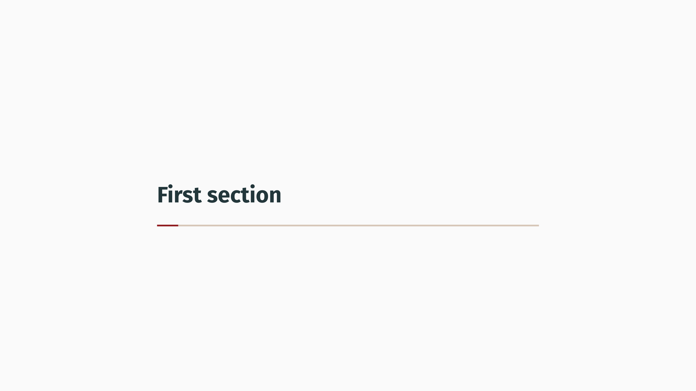
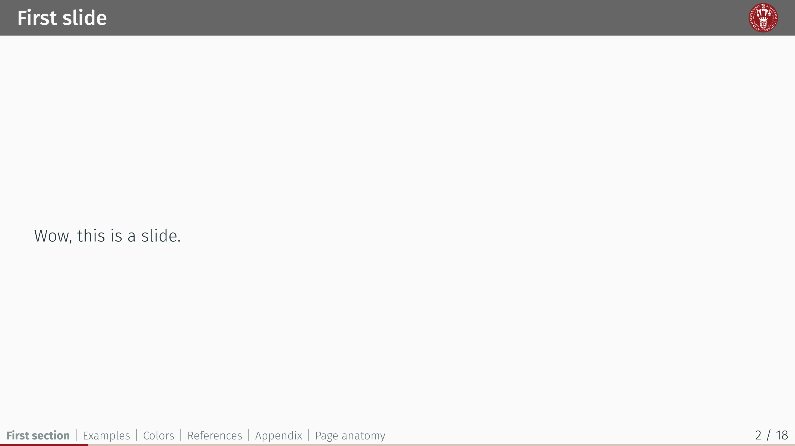

# `ucph-nielsine-touying`
<div align="center">Version 0.1.0</div>

Slide template built on Touying for the University of Copenhagen.

> [!WARNING]
> This theme is **NOT** affiliated with the University of Copenhagen. The logo is the property of the University of Copenhagen.

**ucph-nielsine-touying** is a [Touying](https://github.com/touying-typ/touying) theme for creating presentation slides in [Typst](https://github.com/typst/typst), adhering to the core principles of the [style guide of the University of Copenhagen, Denmark](https://designguide.ku.dk/) (Danish). It is an **unofficial** theme and it is **NOT** affiliated with the University of Copenhagen.

This theme was partly created using components from [typslides](https://github.com/manjavacas/typslides) and [touying-unistra-pristine](https://github.com/spidersouris/touying-unistra-pristine).

## Getting Started

These instructions will get you a copy of the project up and running on the typst web app. 

```typ
#import "@preview/ucph-nielsine-slides:0.1.0" as uc
#import "@preview/touying:0.6.1" as ty

#show: uc.ucph-metropolis-theme.with(ty.config-info(
  title: [Title],
  subtitle: [Subtitle],
  author: [Authors],
  date: datetime.today(),
  institution: [University of Copenhagen],
  logo: image("assets/ucph_1_seal.svg"),
))

#uc.title-slide()

= First section

== First slide
Wow, this is a slide.
```

<kbd></kbd><kbd></kbd><kbd></kbd>

### Installation

A step by step guide that will tell you how to get the development environment up and running. This should explain how to clone the repo and where to (maybe a link to the typst documentation on it), along with any pre-requisite software and installation steps.

```
$ First step
$ Another step
$ Final step
```

## Usage

A more in-depth description of usage. Any template arguments? A complicated example that showcases most if not all of the functions the package provides? This is also an excellent place to signpost the manual.

```typ
#import "@preview/my-package:0.1.0": *

#let my-complicated-example = ...
```

## Additional Documentation and Acknowledgments

* Project folder on server:
* Confluence link:
* Asana board:
* etc...


## Template adaptation checklist

- [ ] Fill out `README.md`
  - Change the `my-package` package name, including code snippets
  - Check section contents and/or delete sections that don't apply
- [ ] Check and/or replace `LICENSE` by something that suits your needs
- [ ] Fill out `typst.toml`
  - See also the [typst/packages README](https://github.com/typst/packages/?tab=readme-ov-file#package-format)
- [ ] Adapt Repository URLs in `CHANGELOG.md`
  - Consider only committing that file with your first release, or removing the "Initial Release" part in the beginning
- [ ] Adapt or deactivate the release workflow in `.github/workflows/release.yml`
  - to deactivate it, delete that file or remove/comment out lines 2-4 (`on:` and following)
  - to use the workflow
    - [ ] check the values under `env:`, particularly `REGISTRY_REPO`
    - [ ] if you don't have one, [create a fine-grained personal access token](https://github.com/settings/tokens?type=beta) with [only Contents permission](https://stackoverflow.com/a/75116350/371191) for the `REGISTRY_REPO`
    - [ ] on this repo, create a secret `REGISTRY_TOKEN` (at `https://github.com/[user]/[repo]/settings/secrets/actions`) that contains the so created token

    if configured correctly, whenever you create a tag `v...`, your package will be pushed onto a branch on the `REGISTRY_REPO`, from which you can then create a pull request against [typst/packages](https://github.com/typst/packages/)
- [ ] remove/replace the example test case
- [ ] (add your actual code, docs and tests)
- [ ] remove this section from the README
